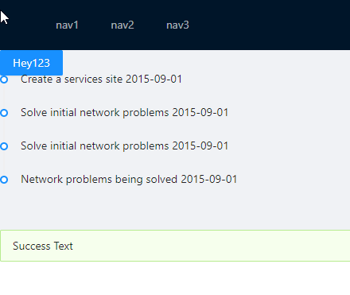
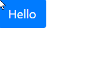

# UniversalDashboard.Factory 

Tools for generating custom components and frameworks for PowerShell Universal.

# Usage

The following example creates a new framework based on [Ant Design](https://ant.design/).

```powershell
Export-UDFramework -Package 'antd' -Name 'AntDesign' -AdditionalImports 'antd/dist/antd.css'
```

The following example creates a new framework based on [React-Bootsrap](https://react-bootstrap.github.io/).

```powershell
Export-UDFramework -Package react-bootstrap -AdditionalPackages bootstrap@4.6.0 -Name bootstrap -AdditionalImports 'bootstrap/dist/css/bootstrap.min.css'
```


# Framework Usage

The framework generated by this tool does not create custom cmdlets but relies on a single `New-UDComponent` cmdlet to create any component in the library. 

```
New-UDComponent -Type 'Layout' -Content {
    New-UDComponent -Type 'Layout.Header' -Content {
        New-UDComponent -Type "Menu" -Properties @{
            mode = "horizontal"
            theme = 'dark'
            onClick = [Endpoint]{ Set-UDElement -Id 'button' -Content { "Cool" } }
        } -Content {
            New-UDComponent -Type "Menu.Item" -Content { "nav1" }
            New-UDComponent -Type "Menu.Item" -Content { "nav2" }
            New-UDComponent -Type "Menu.Item" -Content { "nav3" }
        }
    }
    New-UDComponent -Type 'Layout.Content' -Content {
        New-UDComponent -Type 'Button' -Properties @{
            type = 'primary'
        } -Content {
            "Hey123"
        } -Id 'button'

        New-UDComponent -Type 'Timeline' -Content {
            New-UDComponent -Type 'Timeline.Item' -Content { 'Create a services site 2015-09-01' }
            New-UDComponent -Type 'Timeline.Item' -Content { 'Solve initial network problems 2015-09-01' }
            New-UDComponent -Type 'Timeline.Item' -Content { 'Solve initial network problems 2015-09-01' }
            New-UDComponent -Type 'Timeline.Item' -Content { 'Network problems being solved 2015-09-01' }
        }
        New-UDComponent -Type 'Alert' -Properties @{
            message = 'Success Text'
            type = 'success'
        }
    }
}
```



## Bootstrap

```
New-UDComponent -Type 'Button' -Content {
    "Hello"
} -Properties @{
    variant = 'primary'
}
```



# Benefits

- Generate a new framework with a single command
- Automatically adds support for things like Set-UDElement

# Limitations

There are many limitations to this tool.

- No custom functions for components
- No packaging optimization so large bundle sizes
- Event handlers are currently not working 
- State management hasn't be worked out. 
- Modals and toasts currently don't work